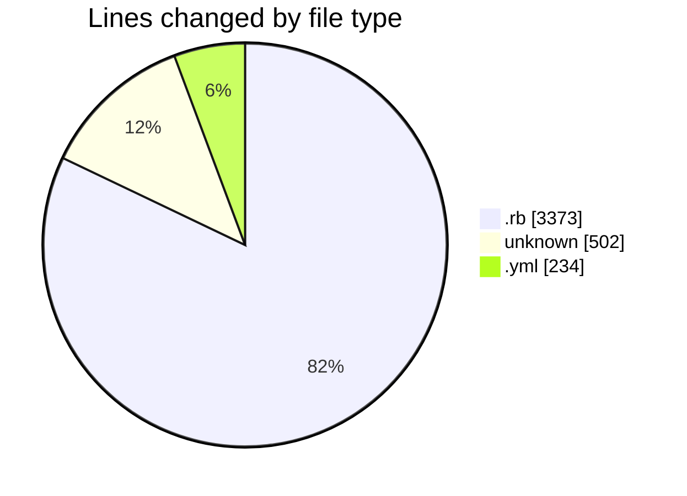
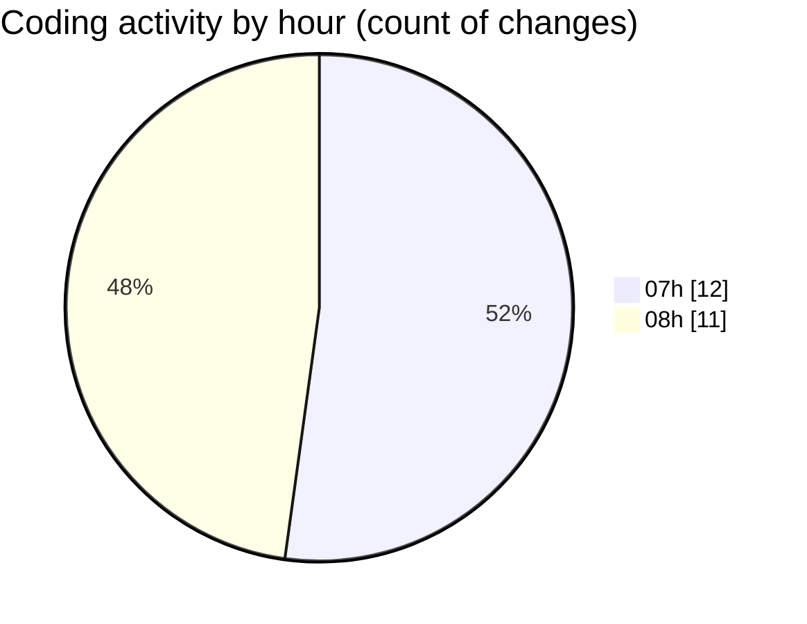

# app [Container registration-app (calm-app)] - Activity Summary 

## Overall Statistics

| Stat                   | Value                                                             |
| ---------------------- | ----------------------------------------------------------------- |
| **Lines Added** (➕)   | 4067                                          |
| **Lines Removed** (➖) | 42                                        |
| **Net Change** (↕)    | 4025                |
| **Active Time** (⌚)   | 22 minutes |

## Modified Files
- **system_spec_helper.rb** (+221, -17)
- **course_enrolment_spec.rb** (+705, -20)
- **Gemfile** (+502, -0)
- **docker-compose.yml** (+229, -5)
- **dana_list_service.rb** (+51, -0)
- **enrolment_form.rb** (+500, -0)
- **enrolment_form_validations.rb** (+337, -0)
- **event.rb** (+1522, -0)

## Visualizations

### By File Type (Lines Changed)

### By Hour (Estimated Activity Count)

> **Last Updated:** 6/19/2025, 9:01:01 AM