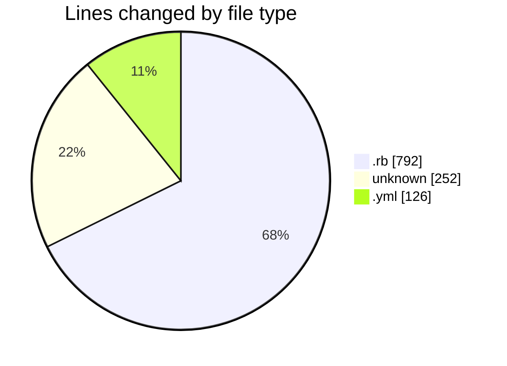
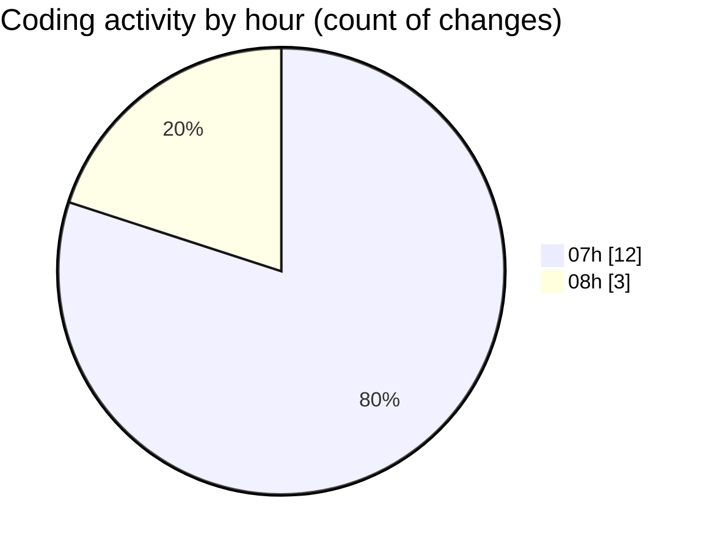

# app [Container registration-app (calm-app)] - Activity Summary 

## Overall Statistics

| Stat                   | Value                                                             |
| ---------------------- | ----------------------------------------------------------------- |
| **Lines Added** (➕)   | 1128                                          |
| **Lines Removed** (➖) | 42                                        |
| **Net Change** (↕)    | 1086                |
| **Active Time** (⌚)   | 22 minutes |

## Modified Files
- **system_spec_helper.rb** (+129, -17)
- **course_enrolment_spec.rb** (+626, -20)
- **Gemfile** (+252, -0)
- **docker-compose.yml** (+121, -5)

## Visualizations

### By File Type (Lines Changed)

### By Hour (Estimated Activity Count)

> **Last Updated:** 6/19/2025, 8:02:04 AM